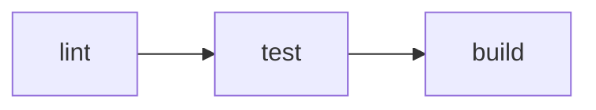

# Ejecutar (Run)

`vp run` ejecuta tareas y scripts de `package.json` definidos en `vite.config.ts`. Funciona como `pnpm run`, con caché, orden de dependencias y ejecución consciente del workspace de forma integrada.

::: tip
`vpr` está disponible como un atajo independiente para `vp run`. Todos los ejemplos a continuación funcionan tanto con `vp run` como con `vpr`.
:::

## Vista General

Usa `vp run` con scripts de `package.json` existentes:

```json [package.json]
{
  "scripts": {
    "build": "node compile-legacy-app.js",
    "test": "jest"
  }
}
```

`vp run build` ejecuta el script de construcción asociado:

```
$ node compile-legacy-app.js

building legacy app for production...

✓ built in 69s
```

Usa `vp run` sin un nombre de tarea para usar el ejecutor interactivo de tareas:

```
Select a task (↑/↓, Enter to run, Esc to clear):

  › build: node compile-legacy-app.js
    test: jest
```

## Caché

Los scripts de `package.json` no se almacenan en caché por defecto. Usa `--cache` para habilitar el almacenamiento en caché:

```bash
vp run --cache build
```

```
$ node compile-legacy-app.js
✓ built in 69s
```

Si nada cambia, la salida se reproduce desde el caché en la siguiente ejecución:

```
$ node compile-legacy-app.js ✓ cache hit, replaying
✓ built in 69s

---
vp run: cache hit, 69s saved.
```

Si un archivo de entrada cambia, la tarea se ejecuta de nuevo:

```
$ node compile-legacy-app.js ✗ cache miss: 'legacy/index.js' modified, executing
```

## Definiciones de Tareas

Vite Task rastrea automáticamente qué archivos utiliza tu comando. Puedes definir tareas directamente en `vite.config.ts` para habilitar el caché por defecto o controlar qué archivos y variables de entorno afectan al comportamiento del caché.

```ts [vite.config.ts]
import { defineConfig } from 'vite-plus';

export default defineConfig({
  run: {
    tasks: {
      build: {
        command: 'vp build',
        dependsOn: ['lint'],
        env: ['NODE_ENV'],
      },
      deploy: {
        command: 'deploy-script --prod',
        cache: false,
        dependsOn: ['build', 'test'],
      },
    },
  },
});
```

Si deseas ejecutar un script de `package.json` existente tal cual, usa `vp run <script>`. Si deseas caché a nivel de tarea, dependencias o controles de entorno/entrada, define una tarea con un `command` explícito. El nombre de una tarea puede provenir de `vite.config.ts` o `package.json`, pero no de ambos.

::: info
Las tareas definidas en `vite.config.ts` se almacenan en caché por defecto. Los scripts de `package.json` no. Consulta [¿Cuándo se habilita el caché?](/guide/cache#¿cuándo-se-habilita-el-caché?) para ver el orden de resolución completo.
:::

Consulta [Configuración de Ejecución](/config/run) para ver la referencia completa del bloque `run`.

## Dependencias de Tareas

Usa [Dependencias de Tareas](#dependencias-de-tareas) para ejecutar tareas en el orden correcto. Ejecutar `vp run deploy` con la configuración anterior ejecuta primero `build` y `test`. Las dependencias también pueden dirigirse a otros paquetes en el mismo proyecto con la notación `paquete#tarea`:

```ts [vite.config.ts]
dependsOn: ['@my/core#build', '@my/utils#lint'];
```

## Ejecutar en un Workspace

Sin parámetros de selección de paquetes, `vp run` ejecuta la tarea en el paquete de tu directorio de trabajo actual:

```bash
cd packages/app
vp run build
```

También puedes dirigirte a un paquete explícitamente desde cualquier lugar:

```bash
vp run @my/app#build
```

El orden de los paquetes del workspace se basa en el grafo de dependencias normal del monorepo declarado en el `package.json` de cada paquete. En otras palabras, cuando Vite+ habla de dependencias de paquetes, se refiere a las relaciones de `dependencies` regulares entre los paquetes del workspace, no a un grafo separado específico del ejecutor de tareas.

### Recursivo (`-r`)

Ejecuta la tarea en cada paquete del workspace, en su orden de dependencia:

```bash
vp run -r build
```

Ese orden de dependencia proviene de los paquetes del workspace referenciados a través de las dependencias del `package.json`.

### Transitivo (`-t`)

Ejecuta la tarea en un paquete y en todas sus dependencias:

```bash
vp run -t @my/app#build
```

Si `@my/app` depende de `@my/utils`, que a su vez depende de `@my/core`, esto ejecuta los tres en orden. Vite+ resuelve esa cadena desde las dependencias normales de los paquetes del workspace declaradas en `package.json`.

### Filtro (`--filter`)

Selecciona paquetes por nombre, directorio o patrón glob. La sintaxis coincide con la de `--filter` de pnpm:

```bash
# Por nombre
vp run --filter @my/app build

# Por glob
vp run --filter "@my/*" build

# Por directorio
vp run --filter ./packages/app build

# Incluir dependencias
vp run --filter "@my/app..." build

# Incluir dependientes
vp run --filter "...@my/core" build

# Excluir paquetes
vp run --filter "@my/*" --filter "!@my/utils" build
```

Múltiples parámetros `--filter` se combinan como una unión. Los filtros de exclusión se aplican después de todas las inclusiones.

### Raíz del Workspace (`-w`)

Ejecuta explícitamente la tarea en el paquete de la raíz del workspace:

```bash
vp run -w build
```

## Comandos Compuestos

Los comandos unidos con `&&` se dividen en subtareas independientes. Cada subtarea se almacena en caché por separado cuando el [caché está habilitado](/guide/cache#¿cuándo-se-habilita-el-caché?). Esto funciona tanto para tareas de `vite.config.ts` como para scripts de `package.json`:

```json [package.json]
{
  "scripts": {
    "check": "vp lint && vp build"
  }
}
```

Ahora, ejecuta `vp run --cache check`:

```
$ vp lint
Found 0 warnings and 0 errors.

$ vp build
✓ built in 28ms

---
vp run: 0/2 cache hit (0%).
```

Cada subtarea tiene su propia entrada de caché. Si solo cambiaron los archivos `.ts` pero lint aún pasa, solo `vp build` se ejecutará de nuevo la próxima vez que se llame a `vp run --cache check`:

```
$ vp lint ✓ cache hit, replaying
$ vp build ✗ cache miss: 'src/index.ts' modified, executing
✓ built in 30ms

---
vp run: 1/2 cache hit (50%), 120ms saved.
```

### `vp run` Anidado

Cuando un comando contiene `vp run`, Vite Task lo integra como tareas separadas en lugar de generar un proceso anidado. Cada subtarea se almacena en caché de forma independiente y la salida se mantiene plana:

```json [package.json]
{
  "scripts": {
    "ci": "vp run lint && vp run test && vp run build"
  }
}
```

Ejecutar `vp run ci` se expande en tres tareas:



Los parámetros también funcionan dentro de los scripts anidados. Por ejemplo, `vp run -r build` dentro de un script se expande en tareas de construcción individuales para cada paquete.

::: info
Un patrón común en monorepos es un script en la raíz que ejecuta una tarea de forma recursiva:

```json [package.json (raíz) ~vscode-icons:file-type-node~]
{
  "scripts": {
    "build": "vp run -r build"
  }
}
```

Esto crea una potencial recursión: `build` de la raíz -> `vp run -r build` -> incluye `build` de la raíz -> ...

Vite Task detecta esto y poda la autorreferencia automáticamente, para que los demás paquetes se construyan normalmente.
:::

## Resumen de Ejecución

Usa `-v` para mostrar un resumen de ejecución detallado:

```bash
vp run -r -v build
```

```
━━━━━━━━━━━━━━━━━━━━━━━━━━━━━━━━━━━━━━━━━━━━━━━
    Vite+ Task Runner • Resumen de Ejecución
━━━━━━━━━━━━━━━━━━━━━━━━━━━━━━━━━━━━━━━━━━━━━━━

Estadísticas:  3 tareas • 3 aciertos de caché • 0 fallos de caché
Rendimiento:   100% de tasa de aciertos, 468ms ahorrados en total

Detalles de Tarea:
────────────────────────────────────────────────
  [1] @my/core#build: ~/packages/core$ vp build ✓
      → Acierto de caché - salida reproducida - 200ms ahorrados
  ·······················································
  [2] @my/utils#build: ~/packages/utils$ vp build ✓
      → Acierto de caché - salida reproducida - 1500ms ahorrados
  ·······················································
  [3] @my/app#build: ~/packages/app$ vp build ✓
      → Acierto de caché - salida reproducida - 118ms ahorrados
━━━━━━━━━━━━━━━━━━━━━━━━━━━━━━━━━━━━━━━━━━━━━━━
```

Usa `--last-details` para mostrar el resumen de la última ejecución sin volver a ejecutar las tareas:

```bash
vp run --last-details
```

## Concurrencia

Por defecto, se ejecutan hasta 4 tareas al mismo tiempo. Usa `--concurrency-limit` para cambiar esto:

```bash
# Ejecutar hasta 8 tareas a la vez
vp run -r --concurrency-limit 8 build

# Ejecutar las tareas una por una
vp run -r --concurrency-limit 1 build
```

El límite también puede establecerse mediante la variable de entorno `VP_RUN_CONCURRENCY_LIMIT`. El flag `--concurrency-limit` tiene prioridad sobre la variable de entorno.

### Modo Paralelo

Usa `--parallel` para ignorar las dependencias de tareas y ejecutar todas a la vez con concurrencia ilimitada:

```bash
vp run -r --parallel dev
```

Esto es útil cuando las tareas son independientes y deseas el máximo rendimiento. Puedes combinar `--parallel` con `--concurrency-limit` para ejecutar tareas sin orden de dependencia pero limitando el número de tareas concurrentes:

```bash
vp run -r --parallel --concurrency-limit 4 dev
```

## Argumentos Adicionales

Los argumentos después del nombre de la tarea se pasan al comando de la tarea:

```bash
vp run test --reporter verbose
```

